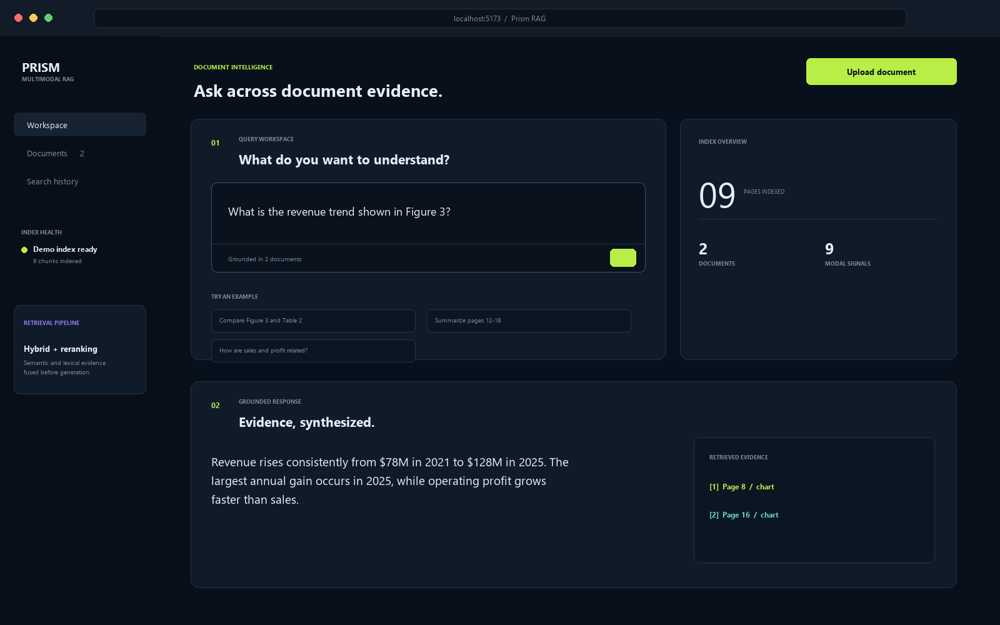
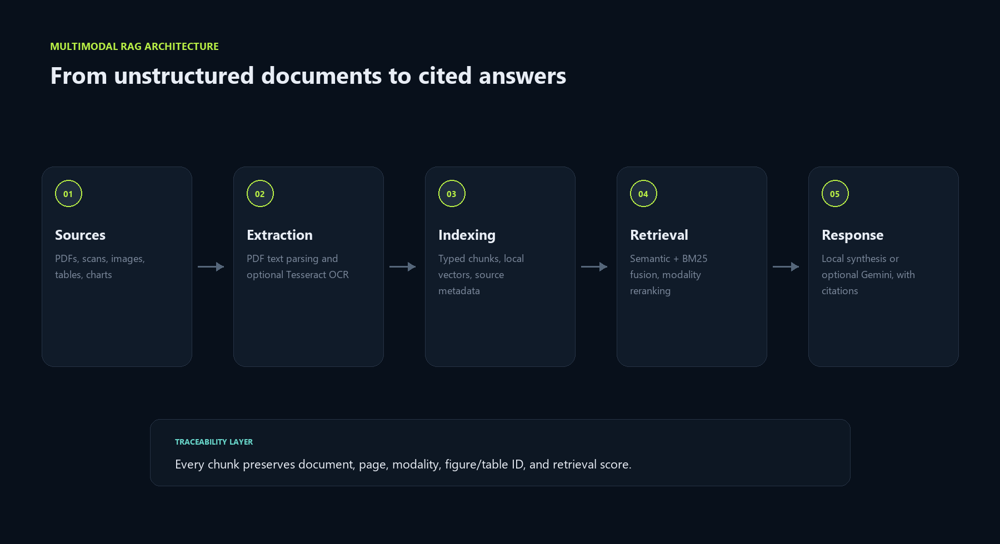
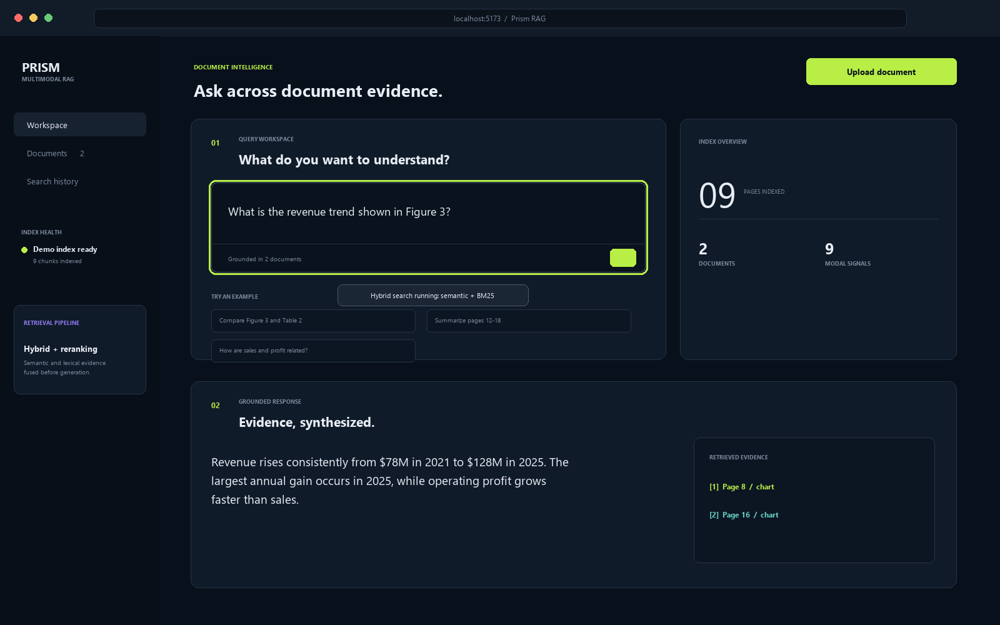
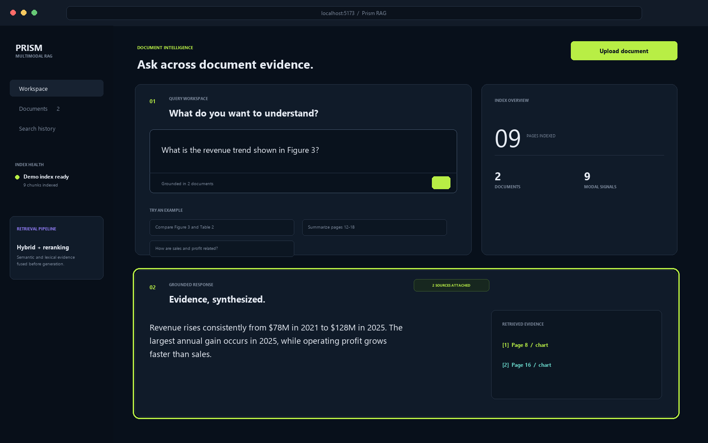

# Multimodal RAG System

[](.github/workflows/ci.yml)
[](https://www.python.org/)
[](https://fastapi.tiangolo.com/)
[](https://react.dev/)
[](LICENSE)

A portfolio-scale retrieval-augmented generation prototype for PDFs, images, and text files. It extracts available text, combines local semantic and BM25 retrieval, reranks evidence, and returns answers with document and page citations.



## Honest Scope

This repository demonstrates a local prototype, not a production deployment.

- Text PDFs are parsed page by page with `pypdf`.
- Image uploads use Tesseract OCR when the Tesseract binary is installed.
- The included synthetic reports have curated chart, table, image, and scan descriptions so multimodal retrieval can be tested deterministically.
- Uploaded charts are not automatically interpreted beyond extractable text or OCR.
- Gemini can be enabled for answer synthesis; the default demo uses a deterministic local synthesizer and requires no API key.
- No private documents, internal servers, real hardware, or company data are used.

## Problem Statement

Text-only RAG loses useful context when evidence is presented as a table, chart, scanned note, or image. This prototype stores a modality label and source metadata with every chunk, then uses query intent to rank chart and table evidence alongside ordinary text.

## Implemented Architecture



```text
PDF / image / text upload
          |
          v
pypdf text extraction or optional Tesseract OCR
          |
          v
typed chunks + document/page metadata
          |
          +---- local hash-vector search
          +---- BM25 lexical search
                         |
                         v
                 score fusion + reranking
                         |
                         v
              local or optional Gemini answer
                         |
                         v
                inspectable page citations
```

Read the [architecture notes](docs/ARCHITECTURE.md) and [API reference](docs/API.md).

## Features

- PDF, PNG, JPG, WEBP, TIFF, TXT, Markdown, and CSV ingestion
- Page-level PDF text extraction
- Optional Tesseract OCR for image uploads
- Typed evidence for text, table, chart, image, and scan samples
- Local hash-vector and BM25 retrieval
- Query-aware modality reranking
- Deterministic local answer generation
- Optional Gemini answer generation
- Document, page, modality, excerpt, and reranking score in every citation
- Responsive React interface
- Docker Compose for running the API and UI locally

## Tech Stack

| Layer | Technology |
| --- | --- |
| Backend | Python, FastAPI, Pydantic |
| Frontend | React, Vite |
| Retrieval | Local hash vectors, BM25, deterministic reranker |
| Parsing | pypdf, optional Tesseract OCR |
| Generation | Local extractive synthesizer, optional Gemini |
| Evaluation | DeepEval custom deterministic metrics |
| Packaging | Docker Compose, GitHub Actions |

## Sample Data

The [`samples/`](samples/) directory contains publishable synthetic artifacts:

- two generated PDF reports containing charts, tables, and page text
- a simulated PCIe link-training log
- a simulated GitHub issue
- an example cited API response
- full DeepEval results

The PCIe log and issue simulate validation workflows. They are explicitly marked synthetic and do not claim access to test equipment or internal systems.

## Evaluation

Responses were evaluated using **DeepEval 3.9.9 on a custom eight-question test set**. The evaluation uses deterministic custom metrics and does not call an external judge model.

| Metric | Result on published sample set |
| --- | ---: |
| Retrieval Hit@4 | 100% |
| Expected cited-page coverage | 100% |
| Required-fact coverage | 95.8% |

These results describe only [`evaluation/test_set.json`](evaluation/test_set.json); they are not claims about production accuracy or general hallucination reduction. See the generated [evaluation summary](samples/outputs/evaluation-summary.md) and [per-question results](samples/outputs/deepeval-results.json).

Reproduce the evaluation:

```bash
python -m pip install -r backend/requirements-eval.txt
python evaluation/run_deepeval.py
```

## Quick Start

### Docker

```bash
cp .env.example .env
docker compose up --build
```

Open `http://localhost:5173` for the UI or `http://localhost:8000/docs` for OpenAPI.

### Local Development

```bash
python -m venv .venv
.venv\Scripts\activate
python -m pip install -r backend/requirements.txt
cd backend
python -m uvicorn app.main:app --reload
```

In a second terminal:

```bash
cd frontend
npm install
npm run dev
```

Set `GEMINI_API_KEY` in `.env` to use Gemini instead of the local synthesizer.

## Usage

1. Upload one of the files from `samples/documents/` or another supported file.
2. Ask a question in the workspace.
3. Inspect the returned document, page, modality, excerpt, and reranking score.

Sample questions:

```text
What is the revenue trend shown in Figure 3?
Compare online and store profit in Table 2.
What is the principal operational risk in the scanned note?
How did renewable electricity adoption change by 2025?
```

```bash
curl -X POST http://localhost:8000/api/v1/query \
  -H "Content-Type: application/json" \
  -d '{"question":"Compare online and store profit in Table 2.","top_k":4}'
```

## Screenshots

| Query | Cited result |
| --- | --- |
|  |  |

## Repository Structure

```text
multimodal-rag-system/
|-- backend/              # FastAPI application and tests
|-- frontend/             # React interface
|-- evaluation/           # DeepEval test set and runner
|-- samples/              # PDFs, logs, issues, and outputs
|-- docs/                 # architecture and API notes
|-- screenshots/          # generated UI screenshots
|-- demo/demo.mp4         # generated walkthrough
|-- scripts/              # sample and visual asset generators
`-- docker-compose.yml
```

## Verification

```bash
cd backend
python -m pytest

cd ../frontend
npm run build
```

## Resume Wording

> Built a multimodal RAG prototype that ingests PDFs, images, and text files, combines semantic and BM25 retrieval, and returns evidence-backed answers with page-level citations. Evaluated responses using DeepEval on a custom eight-question test set.

## License

MIT

